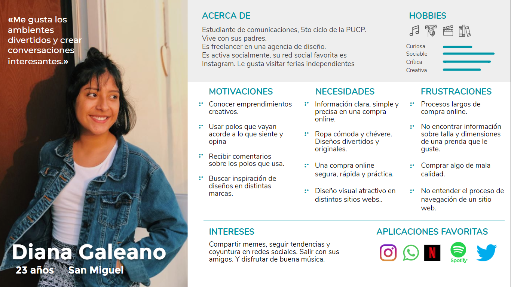
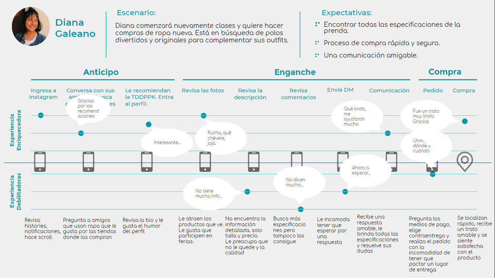
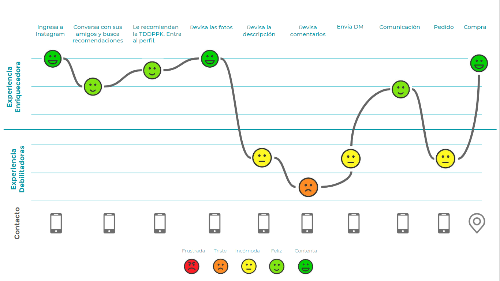
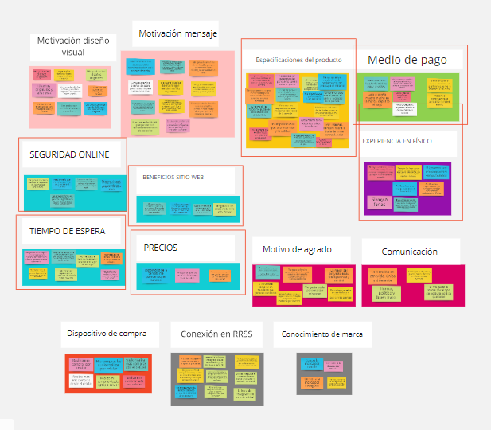
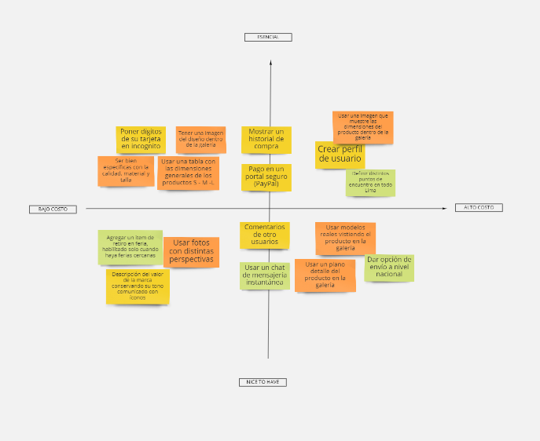

# LA TIENDITA DE DON PPK - ECOMMERCE

_Emprendimiento autogestionado de Trilce Rodriguez. Venta de productos textiles estampados con humor negro, sátira politica, tweets, frases y memes, muchos memes._

## 1. OBJETIVOS

Crear un sitio web que incremente las ventas de nuestro cliente, manteniendo el contacto amigable y humorístico del cliente con sus usuarios. Un sitio web donde se encuentren los detalles de cada producto para evitar dudas al momento de la compra y facilitar la experiencia del usuario.

## 2. PROBLEMAS IDENTIFICADOS 📄
Dentro de los principales problemas extraídos de las entrevista con usuario y cliente tenemos los siguientes:

### Cliente:

 * Saturación de mensajes con los usuarios por atender distintos productos en venta. No llega a contactar a todos
 y pierde algunas ventas
 * Poca disponibilidad de tiempo para estar conectada a redes sociales todo el tiempo.

### Usuario:

 * No suele encontrar información sobre un producto de su interés y tiene la necesidad de escribir un DM en el perfil
 de instagram para poder tener una información completa y realizar su compra satisfactoriamente.
 * Les es tedioso contactar el punto de entrega por el tema de coordinación marca-cliente.

## 3. PÚBLICO OBJETIVO 📌
 
### USER PERSONA

  
### COSTUMER JOUNEY MAP

  
  

## 4. DEFINICIÓN DE LA SOLUCIÓN 🛠️
En base a las distintas entrevistas, y con apoyo del benchmark de navegación y visual. Llegamos a crear un sitio web
con un tono humorístico y navegabilidad amigable, práctica y sencilla de entender.

## 5. PROTOTIPO NAVEGABLE
### PROTOTIPO NAVEGABLE
[Link de prototipo navegable](https://www.figma.com/proto/3OkfYXTrQss4O8YMvn4pY0/Prototipo-final?node-id=1%3A2&scaling=scale-down&hotspot-hints=0)

## 6. Explicación de cómo los contenidos y funcionalidades responden a los objetivos del proyecto.
En base a nuestro affinity map y mapa de prioridades. Se extrajo distintos _Problems Statemens_ para realizar nuestra web respondiendo a las necesidades directas de nuestros usuarios.

## 8. Link de Zeplin, InVision inspects o Marvel Hand-offs para compartir tus diseños con desarrolladores.
* [Link del Zeplin](https://app.zeplin.io/project/5e1510c82dd91e53adf69327)
* [Link de Loom](https://app.zeplin.io/project/5e1510c82dd91e53adf69327)

## 9. LINK DE CARPETA DEL DRIVE 📄
 [Link del Drive](https://drive.google.com/drive/folders/1KEtYo-u2GFWUBpw9tDdNfNEiggv0-hLV?usp=sharing)

## 10. NEXT STEPS 📝
  * Agregar un item de filtros
  * Agregar opción de Quejas y Devoluciones
  * Agregar opción de búsqueda.
  * Sugerencias de productos relacionados

<!-- # Plataforma de ventas en línea

## Índice

* [1. Preámbulo](#1-preámbulo)
* [2. Resumen del proyecto](#2-resumen-del-proyecto)
* [3. Objetivos de aprendizaje](#3-objetivos-de-aprendizaje)
* [4. Consideraciones generales](#4-consideraciones-generales)
* [5. Criterios de aceptación mínimos del proyecto](#5-criterios-de-aceptación-mínimos-del-proyecto)
* [6. Consideraciones técnicas](#6-consideraciones-técnicas)
* [7. Evaluación](#7-evaluación)
* [8. Entrega](#8-entrega)
* [9. Otras consideraciones](#9-otras-consideraciones)
* [10. Hacker edition](#10-hacker-edition)

***

## 1. Preámbulo

En el mundo hay muchas formas de vender en línea, el porcentaje de compradores
online sigue creciendo y la gama de cosas que pueden comprar también lo hace.
Como compradores no siempre somos conscientes de todo lo que debe pasar para que
los productos que necesitamos estén en una repisa del supermercado o de una
tienda. En el comercio minorista hay una serie de intermediarios que en
ocasiones nos hacen perder la pista del ‘viaje’ de un producto; un viaje que va
encareciendo el producto por cada empresa por la que debe pasar hasta que llega
a las manos de nosotros, los consumidores.

En esta realidad hay dos actores perjudicados: el consumidor, que acaba pagando
más por un producto y el productor o fabricante, que se ve presionado a vender
más barato para que su producto llegue al consumidor a un precio asequible y que
todos puedan beneficiarse en el camino.

## 2. Resumen del proyecto

### “Nuevo portal de e-commerce”

Nos han contactado de la Asociación Nacional de Pequeños Comerciantes, una
asociación que agrupa a pequeñas y medianas empresas productoras y fabricantes
de alimentos naturales, postres, accesorios, vestimenta y calzado, y nos piden
que asesoremos a **uno** de sus miembros en crear un portal desde donde los
consumidores compren sus productos sin intermediarios. Entre los miembros puedes
elegir a:

* [Bluebox](https://instagram.com/bluebox.barsupplies)
* [Transversal | Wellness Travels](https://instagram.com/transversaltravel)
* [Pirqa](https://www.pirqa.com/)
* [Mary's](https://instagram.com/marys_postres)
* [Amándote Amar](https://web.facebook.com/amandoteamar.store)
* [FyM Carpintería y Servicios Generales](https://www.facebook.com/fymcarpinteria/)
* [Talleres De Arte TFA](https://www.instagram.com/tallerdeartetfa/)
* [Sweet peach](https://www.facebook.com/sweet.peach.peru/)
* [Le Pastel Bakery](https://www.instagram.com/lepastelbakery/)
* [Delivery Fruta La Grande](https://www.facebook.com/Delivery-Fruta-La-Grande-143207576316285/)

Luego de elegir con qué miembro trabajarás, la ANPC te pide que ayudes a ese
miembro a hacer un estudio inicial de cómo debería ser este portal de ventas y
cómo deben ofrecer los productos a los consumidores. Quieren que averigües cómo
son los consumidores que utilizaría este canal de venta y cuáles son sus
motivaciones, cómo es el mercado actual en el que incursionarán; y que propongas
una visión de cómo podría plantearse este nuevo canal de ventas.

Una vez conozcas a los posibles compradores debes formular una propuesta de
valor. Esto quiere decir que debes pensar cómo este portal va a comunicar sus
beneficios a los usuarios y cómo va a vender sus productos. Para que guíes a la
empresa que elijas a entender tu visión, esperan que les hagas una propuesta de
cómo podría ser el portal donde las personas puedan buscar, ver, elegir y
comprar sus productos.

## 3. Objetivos de aprendizaje

El objetivo principal de aprendizaje de este proyecto es entender cómo pasamos
de lo que un cliente quiere alcanzar a la definición de un producto digital en
poco tiempo. Entender los principales pasos y preguntas que debemos hacernos,
cómo involucrar a los usuarios y su feedback y cómo usar esos resultados sin
perder de vista los objetivos iniciales.
Esperamos que en este proyecto puedas entender las necesidades y falencias de
las empresas, aprender y empezar a empaparte de los posibles modelos de negocio
así como investigar a su audiencia, los usuarios que consumen sus productos,
entendiendo sus preferencias y contexto en el que lo hacen.

De la misma manera deberás definir cuál es la mejor forma de ofrecerle los
productos de tu cliente a sus usuarios, y, pensando en una propuesta de valor y
sus objetivos. También, deberás definir los contenidos, la interacción y el
diseño del proceso a partir del cual el usuario podrá hacer sus pedidos en esta
plataforma.
Este proyecto se debe "resolver" en parejas, por lo que un objetivo importante
es ganar experiencia en trabajos con entrega grupal. Cada uno de las integrantes
será responsable de una parte del trabajo: (1) el entendimiento del problema y
(2) planeamiento y validación de la solución.

### Tópicos a cubrir

Para completar este proyecto tendrás que familiarizarte con conceptos como: UX
research (entrevistas, benchmark), arquitectura de la información (flujo de
contenido, mapa de sitio), diseño visual y de interacción (wireframes y
prototipado), y user testing.

## 4. Consideraciones generales

Para ser una gran UX no sólo debes familiarizarte con los conceptos sino,
también, poner a prueba tus habilidades blandas. El uso de tu curiosidad y
empatía son claves para el éxito laboral.
Para poder realizar una buena entrevista, un benchmark o un user testing
necesitas en todo momento estar atenta al cómo y no sólo al qué. En este
sentido, es esencial que practiques el modo en que te comunicas frente al
cliente y el usuario. Debes pensar quiénes son y qué es lo que necesitan, y no
sólo enfocarte en lo que tú quieres comunicar.

* Relación con el cliente: la empresa miembro con la que te toque trabajar será
  tu cliente. Saber relacionarte con ellos no es fácil. Para comenzar una buena
  relación con el cliente debes escuchar de manera activa qué es lo que necesitan,
  haciendo preguntas que te ayuden a entender sus necesidades para luego buscar
  cómo resolverlas. No trates de dar soluciones inmediatas, escucha y pregunta, la
  curiosidad es clave para entender la problemática. El problema del cliente no
  siempre es el primero que parece, debes investigar la empresa y la competencia
  para entender lo que sucede. Para mantener una buena relación con los clientes
  debes mostrarle cómo se beneficiarán de lo que ofreces; enséñale los posibles
  resultados y el beneficio que ellos podrían obtener. También debes estudiar las
  mejores prácticas en la industria del comercio electrónico para poder mostrarle
  al cliente casos de éxito.

* Benchmark: revisar referencias y dar referencias es clave para tu relación con
  el cliente. Antes de comenzar a crear cualquier producto debes revisar qué está
  haciendo la competencia o industrias similares. De esta manera, puedes traer
  buenas prácticas y evitar replicar aquellas que no son exitosas. Esto al cliente
  le da la confianza de que efectivamente tienes conocimiento de su problemática
  y que has estudiado todas las posibles soluciones. Para que el benchmark sea
  efectivo, tu curiosidad y pensamiento crítico deben ser altos; no sólo buscar
  las referencias que resulten obvias, sino otras industrias que puedan funcionar
  de manera similar o empresas pequeñas que están teniendo casos de éxito.

* Presentación del plan, a dónde vas a ir y por qué: al resolver la problemática
  debes realizar un plan de trabajo, donde se visualicen las herramientas que
  estás utilizando y por qué las escogiste. No todas las problemáticas requieren
  que utilices las mismas herramientas. Debes utilizar la que mejor se ajuste. Es
  importante que siempre sustentes tu idea, no se trata de trabajar de manera
  mecánica para entregar algo al cliente, sino argumentar por qué esa es la mejor
  manera de aproximarse a una posible solución.

* Testing centrado en el usuario: Realizar las pruebas con los usuarios
  garantiza que los problemas se detecten antes, las buenas ideas se introducen
  más rápido y se reducen los esfuerzos de diseño y desarrollo de productos
  innecesarios. Steve Jobs, una vez dijo: "El diseño no es sólo cómo se ve y cómo
  se siente. El diseño es cómo funciona”. Las pruebas de usabilidad son una
  técnica que ayuda a evaluar un producto al probarlo con usuarios reales. El
  testing es una buena forma de profundizar en las necesidades y preferencias de
  los usuarios observando sus reacciones mientras usan un producto. Para que el
  testing realmente esté centrado en el usuario, tú debes centrarte también en él,
  actuando con curiosidad y empatía en todo momento, preguntando de manera activa
  al usuario qué podrías mejorar y buscar aquellos errores que llevarán tu
  producto al siguiente nivel. No trates de que el usuario apruebe tu producto,
  llévalo a buscar las mejoras y posibles errores, generando una relación de
  confianza con el usuario.

Tu curiosidad, empatía y pensamiento crítico son claves para tu éxito como UX
Designer. En cada herramienta que utilices debes poner a prueba tus soft skills.
Nunca des nada por supuesto, siempre pregunta hasta encontrar nuevas respuestas,
debes actuar en todo momento con un pensamiento crítico, sino harás de manera
mecánica tus proyectos sin encontrar soluciones innovadoras. Sé una
investigadora, tu curiosidad es clave en los procesos creativos; pregunta
constantemente y no intentes buscar soluciones inmediatas, aprende a navegar con
la incertidumbre. La empatía es la habilidad que te va a guiar en las relaciones
tanto con el cliente como con el usuario, intenta salir de tu mente y tus
supuestos para entender cómo piensan los otros.

## 5. Criterios de aceptación mínimos del proyecto

### 1) General

En este proyecto necesitarás salir a hablar con usuarios reales y entender
cuáles son sus necesidades, cómo las resuelven actualmente y proponer una
solución óptima para resolver estas necesidades. Mientras resuelves el proyecto
vas a tener que ir documentando las actividades que realices a través de fotos,
videos, textos y scripts. **Utiliza tu en Google Drive para guardar toda esta
documentación y luego linkea las partes más importantes en el `README.md` de tu
repositorio en GitHub**.

En este caso el README.md será la portada de tu solución final, en él tendrás
que mostrar la solución final a través de screenshots y podrás compartir links a
las secciones que detallaremos más adelante.

### 2) Entendimiento del problema

Durante esta parte te asegurarás que el producto que diseñarás es el correcto,
es decir, que sigue objetivos de negocio y que resuelve necesidades reales de
los usuarios. Para ello tendrás que entender al cliente (el miembro de la
Asociación Nacional de Pequeños Comerciantes con quien estás trabajando) y a los
usuarios. Luego de entender el problema, tendrás que plantear cómo es que vas a
resolver dicho problema. Para ello puedes realizar muchas actividades, sin
embargo el tiempo y los recursos que tienes son limitados. Tendrás que elegir
bien qué actividades realizarás.

### 3) Planteamiento y validación de la solución

Luego de haber definido cómo será la solución, es decir, qué
funcionalidades tendrá y por qué, tendrás que implementarla. En este caso,
tendrás que hacer un prototipo de alta fidelidad y tendrás que validarlo. Cómo
en el caso anterior, para crear y validar la solución puedes realizar muchas
actividades, depende de ti elegir cuáles son las más adecuadas para el caso y
los recursos que tienes.

## 6. Consideraciones técnicas

Para poder realizar este proyecto tendrás un presupuesto de 300 puntos. Estos
puntos los podrás utilizar realizando las actividades del siguiente cuadro.
Antes de empezar a realizar estas actividades tendrás que sustentar con tu coach
cómo es que distribuirás estos puntos en estas actividades.
El coach te dará el _OK_ para que puedas empezar.

|Actividad|Descripción|Puntos|
|:----|:---|:---:|
|Entendimiento del problema, la industria y el contexto| Entender el contexto del negocio y lo que existe hoy en día respecto de la industria del proyecto. | 15 |
|Entrevistas con cliente|Realización de entrevistas con el cliente (dueño del reto) y establecimiento de sus metas y objetivos.|25|
|Benchmark| Revisión de features de la competencia y referencias análogas. | 20 |
|Entrevistas con usuarios| Entrevistas en profundidad con al menos 5 usuarios. | 60 |
|Observación contextual| Observación de al menos 5 usuarios en un contexto real de uso/compra. | 35 |
|Inventario de contenidos| Inventario de todos los contenidos de un producto. | 15 |
|Flujo / árbol de contenidos|Documento que estructura contenidos y su navegación|15|
|Card Sorting| Actividad para entender el modelo mental de los usuarios en términos de organización de los contenidos. | 15 |
|Testeo de soluciones actuales de la competencia| Sesiones de testing de productos actuales de la competencia para ver qué atributos valoran los usuarios. Al menos 5 usuarios.| 50 |
|Testeos de prototipos| Sesiones de testing de la solución propuesta con al menos 5 usuarios. | 60 |
|Sketching y wireframing| Elaboración de prototipos de baja y mediana fidelidad. | 30 |
|Prototipado de contenido| Prototipado y testeo del contenido del producto. | 30 |
|Prototipado de alta fidelidad| Elaboración de prototipo en base a las pantallas diseñadas. | 80 |

## 7. Entrega

El proyecto será entregado en un repositorio de GitHub. En él deberás agregar
lo siguiente:

README.md  explicando el proceso del proyecto:

* Objetivos del proyecto
* Problemas identificados en la investigación (del cliente y del usuario)
* Definición del público objetivo
  - User persona
  - Customer Journey Map (indicando pain y gain points)
* Definición de la solución/producto
* Link a prototipo navegable
* Explicación de cómo los contenidos y funcionalidades responden a los objetivos
  del proyecto.
* Explicación de cómo los contenidos y funcionalidades resuelven cada uno de las
  necesidades del usuario final.
* Link de Zeplin, InVision inspects o Marvel Hand-offs para compartir tus
  diseños con desarrolladores.

Un video en Loom de máximo 10 minutos explicando tu documento.

* Estos 10 minutos tienes que utilizarlos para explicar los puntos indicados en
  el `README.md` y para hacer un demo de la solución.

En las otras carpetas del repositorio o en las carpetas de Google Drive podrás
agregar los documentos complementarios que sustenten tu proceso:

* Fotos, videos, guías de las actividades que realizaste
* Flujo de usuario
* Mapa de sitio
* Etc.

## 8. Otras consideraciones

### 1) Planeamiento y presupuesto

Cuando realices el planeamiento de cómo enfrentarás el reto deberás sustentarlo
ante tu cliente y ante un coach. Ellos te darán la aprobación final para seguir
con las actividades planteadas.

### 2) Definición del producto

Al definir el producto recuerda pensar en:

* Quiénes son los principales usuarios de producto
* Cuáles son los objetivos del negocio en relación con el producto
* Cuáles son los objetivos de estos usuarios en relación con el producto
* Cuál será la propuesta de valor del sitio que vas a crear
* Cuáles son los contenidos que el usuarios quiere ver, la información que
  buscarían para convencerse de comprar, confiar en la empresa que lo ofrece,
  encontrar lo que busca y comprarlo
* Cómo vas a distribuir y entregar esos contenidos
* Cómo es el flujo que los usuarios que acaben comprando deberán hacer en la web
* Cómo crees que el producto les está resolviendo sus problemas

### 3) Prototipo de alta fidelidad

Existen varias herramientas que puedes utilizar para crear tu prototipo,
nosotros recomendamos Figma, sin embargo, eres libre de utilizar otras
herramientas como Adobe XD, etc. Si eliges Figma tendrás que usar una
herramienta adicional como Marvel o Invision. Recuerda que el diseño que
trabajes debe seguir los fundamentos de visual design, como: contraste,
alineación, jerarquía, entre otros.

## 9. Hacker edition

* En lugar de usar Github para documentar tu proceso de trabajo, documéntalo en
  su propia web, puedes usar Wix, Instapage, Squarespace, Google Sites o crear
  tu propia web desde 0.
* Escribe un post en Medium contando tu proceso de investigación. -->
